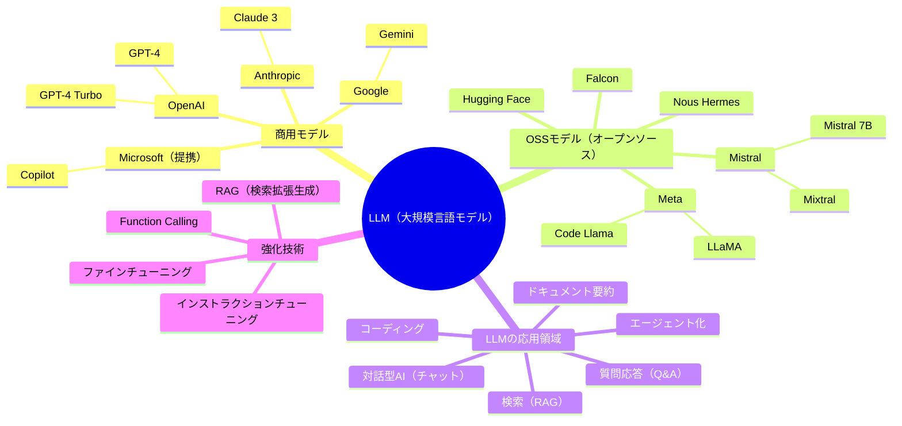
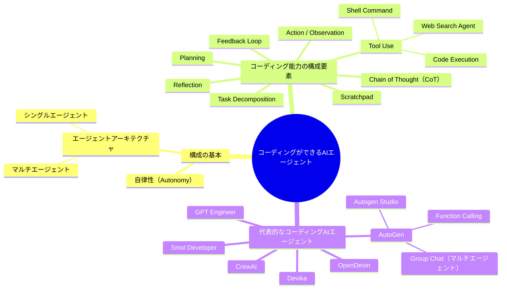

# Dictionary

| 用語                        | 意味                              |
| ------------------------- | ------------------------------- |
| AIエージェント                  | 自律的に思考・計画・行動できるAI。 |
| 自律性（Autonomy）             | 人間の指示なしに自分で判断し行動する能力。           |
| チェーン・オブ・ソート（CoT）          | 複雑なタスクを思考のステップに分けて処理する方法。       |
| Scratchpad                | LLMが使う「思考メモ」。思考の過程（Chain of Thought）を明示するために使う。      |
| リフレクション（Reflection）       | AIが自分の行動を振り返り、改善案を考えるプロセス。      |
| 計画（Planning）              | ゴールに向けたタスクの段取りを立てること。           |
| LLM（Large Language Model） | 大規模言語モデル。膨大なテキストを学習したAI。        |
| Prompt（プロンプト）             | AIに入力する指示文。                     |
| Prompt Engineering        | よりよい応答を得るためのプロンプト設計技術。          |
| マルチエージェント                 | 複数のAIエージェントが役割分担して連携する仕組み。      |
| Tool Use                            | AIが外部のツール（Python、Webなど）を利用する機能。  |
| Code Execution                      | AIが実際にコードを実行して結果を確認する能力。         |
| Web Search Agent                    | Web検索を行って外部情報を取得するエージェント。        |
| RAG（Retrieval-Augmented Generation） | 検索で取得した情報をもとに回答を生成する手法。          |
| Action                              | エージェントが環境に対して実行する操作（API呼び出しなど）。  |
| Observation                         | エージェントが行動後に得る情報（Webの内容、レスポンスなど）。 |
| Task Decomposition                  | 大きなタスクを小さなタスクに分ける工程。             |
| Planning Agent                      | 計画立案に特化したAIエージェント。               |
| Executor Agent                      | 実行専門のAIエージェント。指示に基づき動作。          |
| Feedback Loop                       | 出力結果を再評価し、改善サイクルを回すこと。           |


## Appendix

```
35 + 47 の答えは何ですか？

# Scratchpad:
ステップ1: 30 + 40 = 70  
ステップ2: 5 + 7 = 12  
ステップ3: 70 + 12 = 82  

答え: 82
```

# Explanation - なぜAIエージェントはコーディングできるのか？

## 🧠 第1層：LLMはなぜコードを理解できるのか？

- LLM（大規模言語モデル）は、人間が書いた**大量のコードと自然言語**を学習している。
- 学習データには、**関数名、構文、パターン、コメント**などがセットで含まれている。

そのため、以下のような変換が可能になる：

- ✅ 「自然言語の指示」 → 「コードの生成」
- ✅ 「コードの読み取り」 → 「自然言語による解説」

---

## 🔧 第2層：ツールと組み合わせて「試す→直す」ができる

- LLMは単にコードを書く能力だけでなく、**書いたコードを実行し、修正する**能力を持ち始めている。
- これはLLM単体では不可能だが、**エージェントとしてツールを呼び出す（Tool Use）**ことで実現されている。

### 例：試行ループ

1. Pythonのコードを書く  
2. Shellでコードを実行する  
3. エラーが出たらログを読む  
4. 修正コードを提案・再実行する

このループにより、**精度が高く、継続的に改善されるコーディング能力**を獲得できる。

---

## 🤖 第3層：エージェントは「目的に向けて自律的に行動」できる

LLMが一度コードを生成するだけでなく、次のような「人間的な思考プロセス」を模倣できるようになってきた：

- **Task Decomposition（タスク分割）**
- **Planning（計画）**
- **Reflection / Feedback Loop（振り返りと改善）**
- **Tool Use（ツール使用）**
- **Action / Observation（行動と観察）**

これにより、AIエージェントは**「目的に向かって自律的に開発タスクを進める存在」**へと進化している。

---


# Relation

[Visualization Tool](https://mermaid.live/)

## LLMs



## Agents


